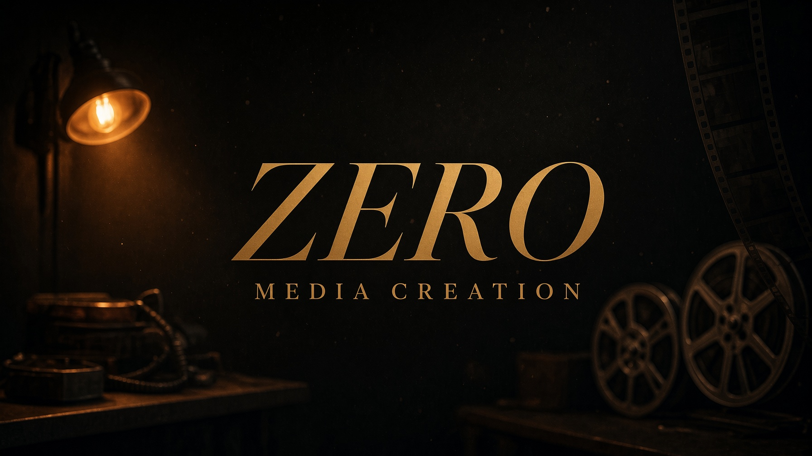
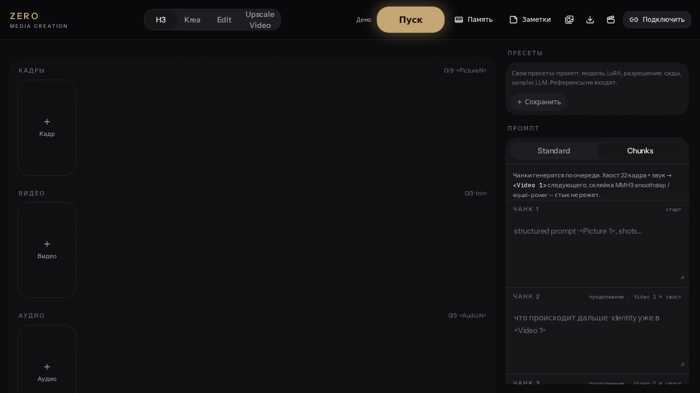
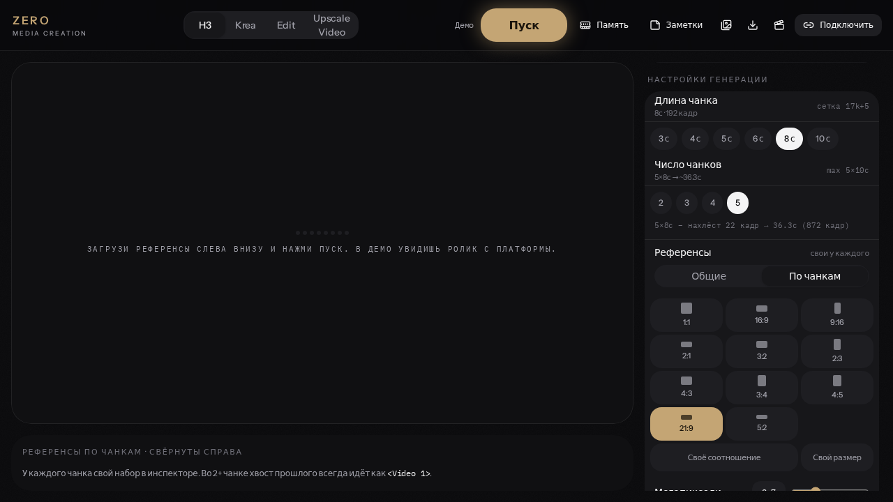
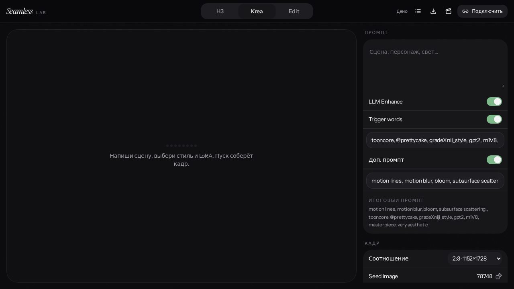
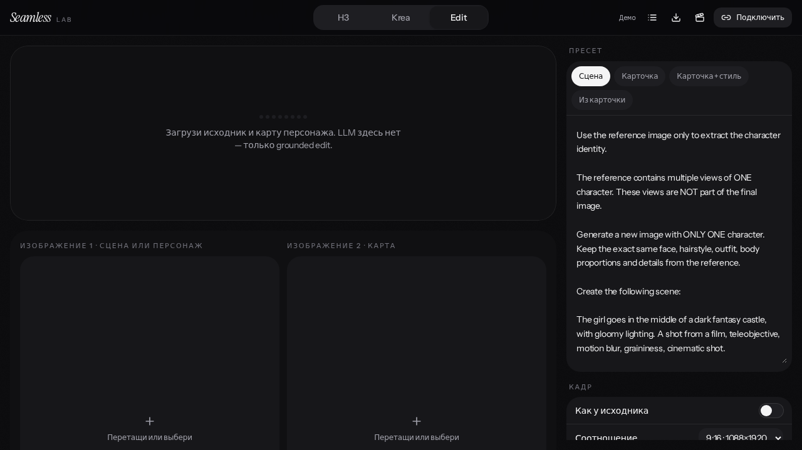
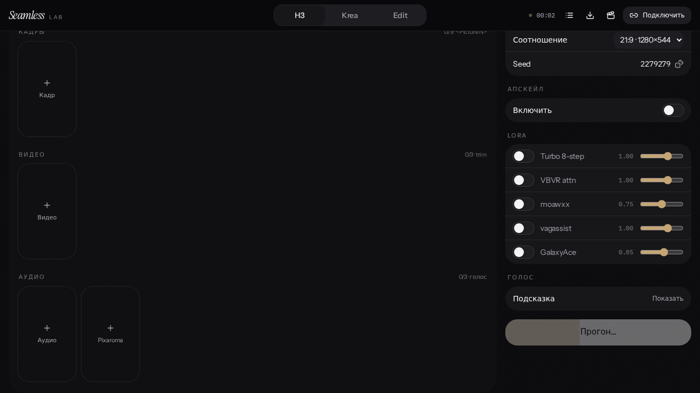
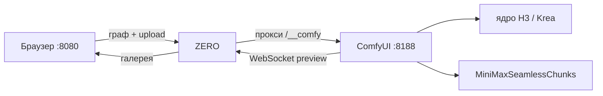

<div align="center">



# ZERO
### Media creation

**Локальная панель над ComfyUI** — MiniMax H3, Krea 2, Edit и апскейл видео.  
Тёмный film-lab интерфейс, живое превью, чанки до ~50 секунд, склейка без стыка.

[Установка](#установка) · [Возможности](#возможности) · [Инструкция](INSTALL.md) · [Seamless Chunks](https://github.com/zeroleloushe/ComfyUI-MiniMaxSeamlessChunks)

<br>

[](https://github.com/Comfy-Org/ComfyUI)
[](https://nodejs.org)
[](LICENSE)
[](https://github.com/zeroleloushe/ComfyUI-MiniMaxSeamlessChunks)

</div>

---

## Зачем это

ComfyUI умеет всё. Ему не хватает одного окна, в котором можно **собрать ролик, не собирая граф руками**.

ZERO — тонкий клиент: ты выбираешь референсы, пишешь промпт, жмёшь **Пуск**. Панель собирает API-граф, гонит его в Comfy на `127.0.0.1:8188`, показывает кадры семплера вживую и кладёт результат в галерею.

Никакого облака. Модели — твои, VRAM — твоя, выход — `output/zero/…`.

<p align="center">
  
  <br>
  <sub>MiniMax H3 · Standard / Chunks · референсы · превью</sub>
</p>

---

## Возможности

<table>
<tr>
<td width="50%">

**H3 — видео**
- Reference-to-video, до 9 кадров / 3 ролика / 3 аудио
- Standard 5–15 с или **Chunks** 2–5 клипов
- Хвост 22 кадра → `<Video 1>`, последний кадр → `<Picture 1>`
- Склейка 2 кадра (`MMH3_ChunkMerge` + audio equal-power)
- Живое превью текущего прохода семплера
- Кнопка Upscale сразу с готового ролика (video latent, без encode)

</td>
<td width="50%">

**Krea 2 / Edit / Upscale**
- Krea 2 Turbo / RAW, свои LoRA и стили
- Edit — identity-preserving, второе фото только если загружено
- Upscale Video — load → encode → 3D latent upscaler → чанки
- Апскейл картинок Krea / Edit — отдельная кнопка в панели
- Галерея с лайтбоксом, зум, метаданные (промпт, сид)
- Очистка VRAM / RAM одной кнопкой

</td>
</tr>
</table>

<p align="center">
  
  <br>
  <sub>Chunks · свои референсы на каждый кусок, или общие на все</sub>
</p>

<p align="center">

&nbsp;

</p>
<p align="center"><sub>Krea 2 · кадр  ·  Krea 2 Edit · редактура</sub></p>

<p align="center">
  
  <br>
  <sub>Живое превью во время прогона · Model Preview Override</sub>
</p>

---

## Как это устроено



Два процесса. Сначала Comfy, потом панель. CORS не нужен: панель ходит в Comfy **со своего сервера**.

При старте сама стучится в `http://127.0.0.1:8188` и показывает тост — подключено или нет.

---

## Установка

Полный путь «с нуля» — Portable, ноды, модели, первый Пуск:

**[INSTALL.md](INSTALL.md) ← начни отсюда**

Коротко, если Comfy уже стоит:

```bash
# 1. Критичный пак чанков / апскейла
cd ComfyUI/custom_nodes
git clone https://github.com/zeroleloushe/ComfyUI-MiniMaxSeamlessChunks

# 2. Панель
git clone https://github.com/zeroleloushe/ZERO-Media-creation.git
cd ZERO-Media-creation
# Windows: start.bat
# macOS / Linux:
chmod +x start.sh && ./start.sh
```

Открой [http://127.0.0.1:8080](http://127.0.0.1:8080). Нужен **Node.js 20+** и **ComfyUI ≥ 0.30** с нативным MiniMax H3.

Без [MiniMaxSeamlessChunks](https://github.com/zeroleloushe/ComfyUI-MiniMaxSeamlessChunks) не работают чанки, склейка и апскейл видео. Это не «ещё одна нода» — на ней завязан весь длинный пайплайн.

---

## Вкладки

| Вкладка | Что делает |
|---|---|
| **H3** | Reference-to-video. Standard или Chunks (3–10 с × 2–5). Референсы общие или по чанкам. |
| **Krea** | Кадр Krea 2. Стили, LoRA, опциональный LLM-промпт, апскейл в панели. |
| **Edit** | Instruction edit. Второе изображение — нода включается только если файл загружен. |
| **Upscale Video** | Готовый mp4 → VAE encode → только **video** latent в 3D-апскейлер → чанки → семплер → склейка. Аудио с исходника. |

После генерации H3 рядом с роликом есть **Upscale**: тот же пайплайн, но latent первого прохода идёт напрямую, без повторного encode.

---

## Кастомные ноды

Обязательные паки — подробно с git clone в [INSTALL.md](INSTALL.md).

| Пак | Зачем |
|---|---|
| [ComfyUI-MiniMaxSeamlessChunks](https://github.com/zeroleloushe/ComfyUI-MiniMaxSeamlessChunks) | чанки, last-frames, merge кадров и звука, latent split |
| [Fantastic H3 Prompt Builder](https://github.com/Adudeguyman/ComfyUI-Fantastic-MiniMaxH3-PromptBuilder) | Media Loader + Reference Splitter |
| [Pixaroma](https://github.com/pixaroma/ComfyUI-Pixaroma) | Seed, LoRA, Save Mp4 |
| [KJNodes](https://github.com/kijai/ComfyUI-KJNodes) | живое превью |
| [Video Helper Suite](https://github.com/Kosinkadink/ComfyUI-VideoHelperSuite) | загрузка ролика в апскейл |
| [Krea2Edit](https://github.com/lbouaraba/comfyui-krea2edit) | вкладка Edit |
| [ContextAnchoredTileRefine](https://github.com/Blakeem/ComfyUI-ContextAnchoredTileRefine) | апскейл Krea / Edit |
| ComfyUI **ядро ≥ 0.30** | `MiniMaxH3ReferenceToVideo`, `LTXVSeparateAVLatent`, `MinimaxH3LatentUpscaler3D` |

Модели: [Comfy-Org/MiniMax-H3](https://huggingface.co/Comfy-Org/MiniMax-H3), [Comfy-Org/Krea-2](https://huggingface.co/Comfy-Org/Krea-2), [3D latent upscaler](https://huggingface.co/LBH-123-AI/Minimax_h3_latent_Upscaler).

---

## Стек панели

TanStack Start · Vite · React · Zustand · прокси на Comfy (`/__comfy`) · IndexedDB галерея.

Windows — `start.bat`. Linux / macOS — `start.sh`. Слушает `0.0.0.0:8080`, с телефона в той же Wi‑Fi открывается по IP компьютера. Адрес Comfy в панели при этом остаётся `127.0.0.1:8188`.

---

## English

Local cinematic frontend for [ComfyUI](https://github.com/Comfy-Org/ComfyUI): **MiniMax H3** video, **Krea 2** stills, identity edit, and latent video upscale. Auto-connects to `http://127.0.0.1:8188`, live sampler preview, seamless chunk generation up to ~50 s via [MiniMaxSeamlessChunks](https://github.com/zeroleloushe/ComfyUI-MiniMaxSeamlessChunks).

Requires Node 20+ and ComfyUI 0.30+. Full walkthrough (Portable → nodes → models → first run) is in **[INSTALL.md](INSTALL.md)** (Russian, step-by-step).

```bash
git clone https://github.com/zeroleloushe/ZERO-Media-creation.git
cd ZERO-Media-creation && npm install && npm run dev
# → http://127.0.0.1:8080
```

---

<div align="center">

**ZERO** · Media creation  
MIT · [zeroleloushe](https://github.com/zeroleloushe)

</div>
